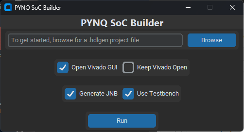

# Automated PYNQ Overlay Generation Extension for HDLGen-ChatGPT

## Overview 

PYNQ Automate is a tool for generating PYNQ Overlays in Vivado automatically.

## Installation

1. Clone this repo to any directory
2. Open Command Prompt and go to the cloned repo directory
3. Install the required libraries using ```pip install -r requirements.txt```
4. Install PYNQ-Z2 board in Vivado by unzipping _pynq-z2.zip_ at ```<Xilinx installation directory>/Vivado/<version>/data/boards/board_files```

## Run Application

```python main_gui.py```





### Run CLI

PYNQ SoC Builder can also be run as a command-line tool: ```python main_cli.py```
