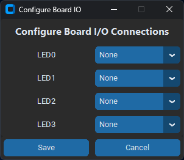
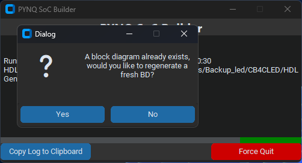

# PYNQ SoC Builder for HDLGen-ChatGPT

## Overview 

PYNQ SoC Builder is a standalone Python application which:

- Configures Vivado project for PYNQ-Z2
- Generates and imports PYNQ-Z2 board constraints
- Creates and populates Vivado Block Design
- Configures PYNQ board I/O connections
- Performs synthesis, implementation and bitstream generation
- Generates Jupyter Notebook project based on provided test plan

## Installation

1. Clone this repo to any directory
2. Open Command Prompt and go to the cloned repo directory
3. Install the required libraries using ```pip install -r requirements.txt```
4. Install PYNQ-Z2 board in Vivado by unzipping _pynq-z2.zip_ at ```<Xilinx installation directory>/Vivado/<version>/data/boards/board_files```

## Run Application

```
python main.py
```

## How to Use

To open a HDLGen project use the browse option to find the project's .hdlgen file.


### Options:

- **Open Vivado GUI**: Should the Vivado GUI be visable whilst build is executing. (Headless mode may improve performance)
- **Keep Vivado Open:** This flag keeps Vivado open after bitstream generation has completed, user must manually close Vivado to complete SoC Builder process.
- **Generate JNB:** This flag enables Jupyter Notebook generation.
- **Use Testplan:**  If not enabled, a generic .ipynb project is generated. If enabled, code to execute each individual testcase is generated as cells in JNB project.
- **Use Board I/O:** If disabled, no I/O connections to PYNQ ports are made. If enabled, configuration defined in configuration pop-up menu is applied (select Configure I/O button to set)

**_Please note_** more I/O ports available on PYNQ are to be added shortly 
<p align="center">



</p>

## Screenshots from Project





</p>

## Notes

- If a signal is to be used for I/O all bits of the chosen signal must be used - When a port is made; this is because once a signal has been made external, no floating pins are allowed.

