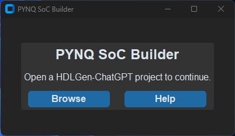
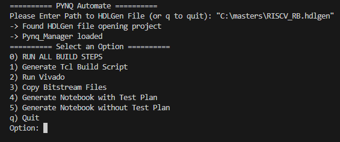
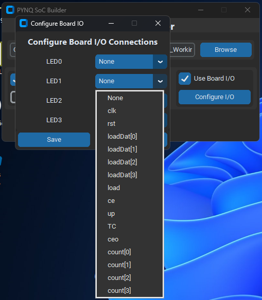
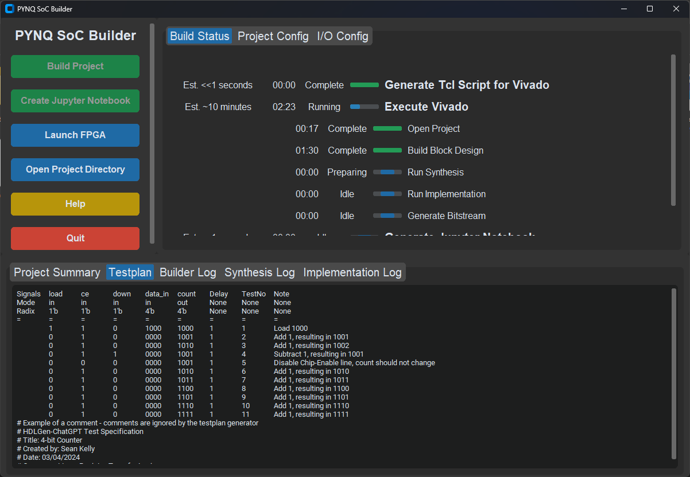
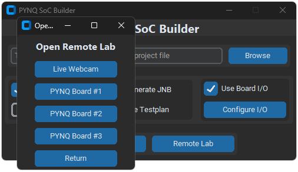
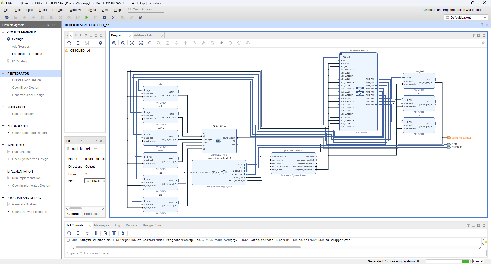
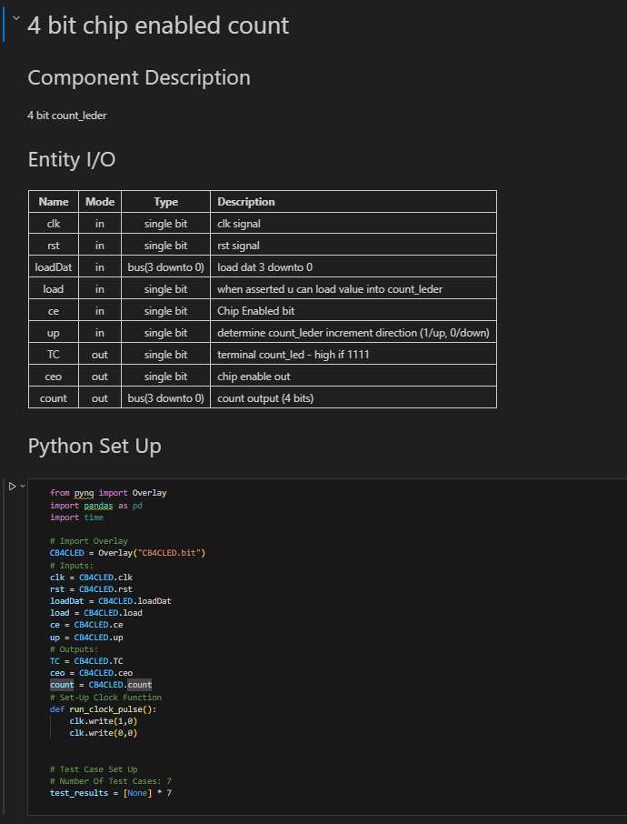
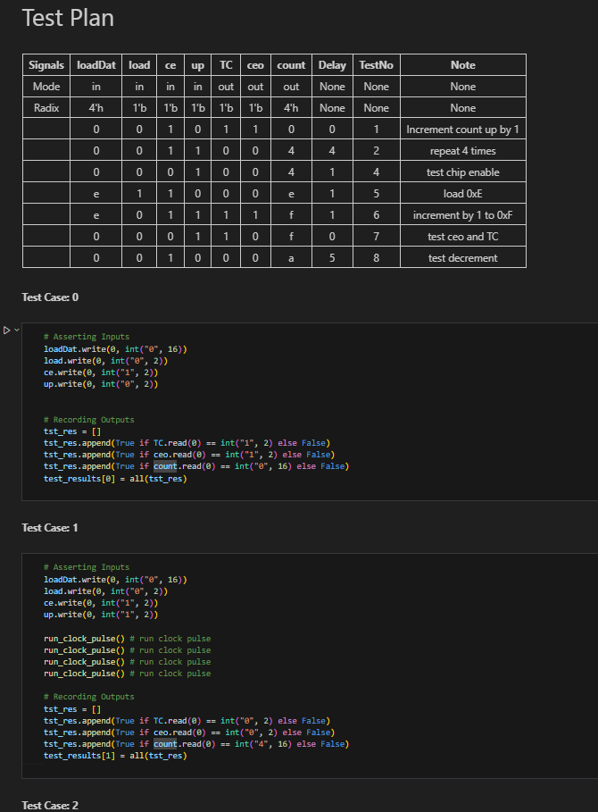

# PYNQ SoC Builder for HDLGen-ChatGPT

## Overview 

PYNQ SoC Builder is a standalone Python application which:

- Configures Vivado project for PYNQ-Z1 or PYNQ-Z2
- Generates and imports master board constraints
- Creates and populates Vivado Block Design
- Configures PYNQ board I/O connections (LEDs, Switches, Buttons)
- Performs synthesis, implementation and bitstream generation
- Generates Jupyter Notebook project based on provided test plan

PYNQ SoC Builder is compatible with Vivado 2019.1 and 2023.2. Versions in between may work, but are untested.

## Installation

1. Clone this repo to any directory
2. Open Command Prompt and go to the cloned repo directory
3. Install the required libraries using ```pip install -r requirements.txt```
4. Run Application using ```python main.py```

## How to Use

To open a HDLGen project use the browse option to find the project's .hdlgen file.

### Open Project Prompt



### Main Menu



#### Options

**Vivado Settings**

- **Open Vivado GUI**: Should the Vivado GUI be visable whilst build is executing. (Headless mode may improve performance)
- **Keep Vivado Open:** This flag keeps Vivado open after bitstream generation has completed, user must manually close Vivado to complete SoC Builder process.
- **Always regenerate block design:** This flag allows the user to manually create a new/modify an existing block design and allow SoC Builder to generate a bitstream using it.

**Jupyter Notebook Settings**

- **Generate when Building:** This flag enables Jupyter Notebook generation.
- **Generate using Testplan:**  If not enabled, a generic .ipynb project is generated. If enabled, code to execute each individual testcase is generated as cells in JNB project.

**FPGA Settings**

- **Select FPGA:** This dropdown menu allows users to select between the PYNQ-Z1 and PYNQ-Z2 boards.

### IO Config Menu

From the Configure I/O config menu, any HDLGen port (or externalized internal signal) may be connected to PYNQ ports.



- **Use Board I/O:** If disabled, no I/O connections to PYNQ ports are made. If enabled, configuration defined in configuration pop-up menu is applied (select Configure I/O button to set)

## Running a Build

Once configured, the program may be run. Once the build has been completed, all output files are available at ```<SoC-Builder-Directory>\output\```, this folder can be reached using the "Open Project Directory" button on the sidebar.



Once the build has completed and you are ready to use PYNQ Z2 remote lab, select the "Remote Lab" option on the Main Menu. You will have an opportunity to select online boards or a livestream of the boards (for viewing LED I/O output).

<!--  -->

Selecting an option will open the corresponding board's Jupyter Notebook environment in your default web-browser.

## Results

### Block Design generated by SoC Builder on a CB4CLED project.



### Jupyter Notebook produced from testplan for CB4CLED





## Masters Paper


## Project Poster

[Project Poster](docs/project_poster.png)

## Contact Me

You may contact me at lcanny8@gmail.com
