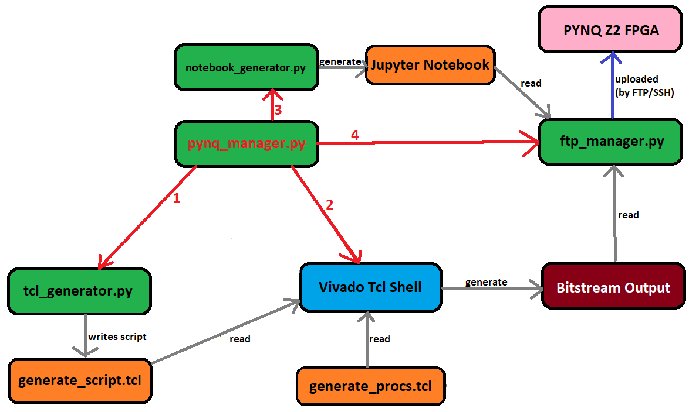

# Automated PYNQ Overlay Generation

## Overview 

PYNQ Automate is a CLI tool for generating PYNQ Overlays in Vivado automatically.

## Installation

1. Clone this repo to any directory
2. Open CMD or Anaconda terminal and go to the cloned repo directory
3. Install the required libraries using ```pip install -r requirements.txt```

## Run Application in Terminal

```
python main_cli.py
```

## Overview of System to date



