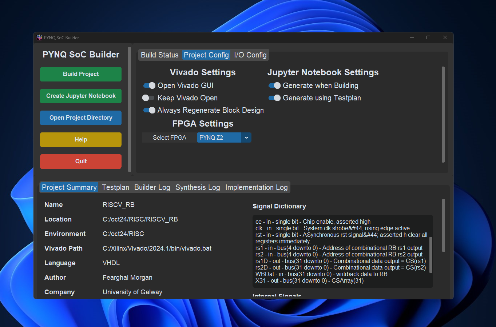
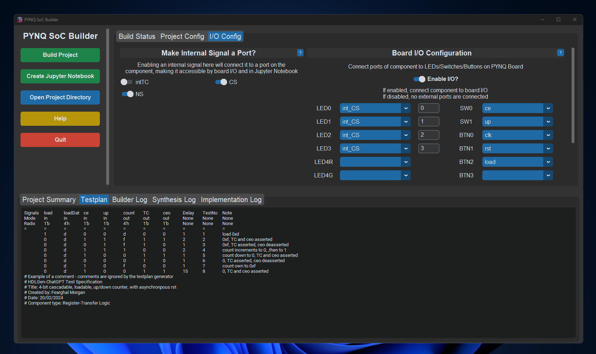
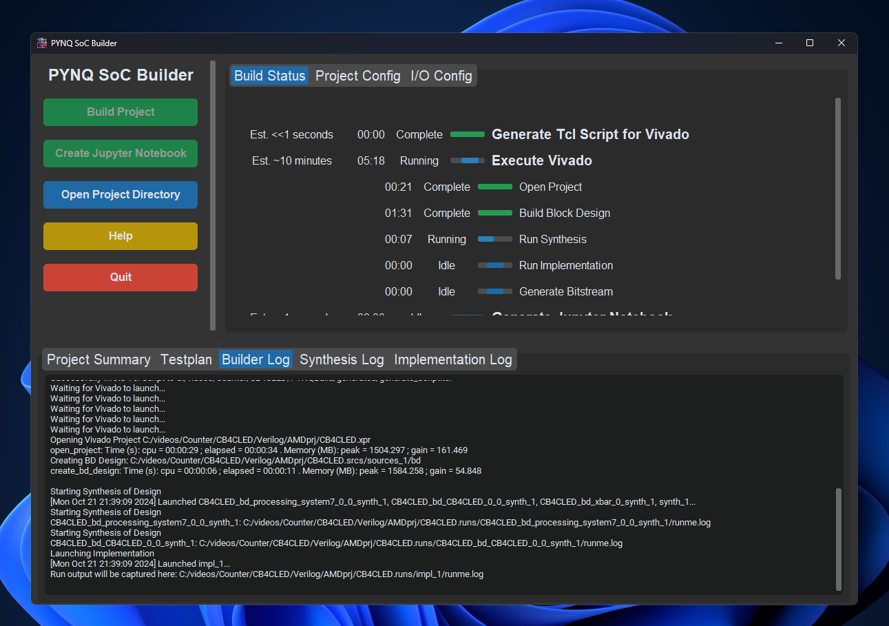

<p align="center">
  
</p>

<div align="center">
  <a href="https://github.com/Logicademy/PYNQ-SoC-Builder/actions/workflows/build_and_release.yml">
    
  </a>
</div>

If you encounter any issues, please don't hesitate to [open an issue](https://github.com/Logicademy/PYNQ-SoC-Builder/issues/new) at our GitHub page. Thanks!

## Overview 

PYNQ SoC Builder is a standalone Python application that:

- Configures Vivado project for PYNQ-Z1 or PYNQ-Z2
- Generates and imports master board constraints
- Creates and populates Vivado Block Design
- Configures PYNQ board I/O connections (LEDs, Switches, Buttons)
- Performs synthesis, implementation and bitstream generation
- Generates Jupyter Notebook project based on providing an interactive environment and automated test plan stimulus generation!

PYNQ SoC Builder is compatible with both Vivado 2023.2 and 2024.1. Other versions may work, but are untested.



## Learn More

A database of videos and tutorials can be found [here](docs/markdown/resources.md)

## Installation

1. Clone this repo to any directory. (It is recommended to use a short directory such as C:\logicademy\ to avoid Windows & Vivado path length issues caused when subdirectories become >255 characters)
3. Open CommandPrompt/Terminal and go to the cloned repo directory
4. Install the required libraries using ```pip install -r requirements.txt```
5. Run Application using ```python main.py```


## Project Configuration

**Vivado Settings**

- **Open Vivado GUI**: Should the Vivado GUI be visable whilst build is executing. (Headless mode may improve performance)
- **Keep Vivado Open:** This flag keeps Vivado open after bitstream generation has completed, user must manually close Vivado to complete SoC Builder process.
- **Always regenerate block design:** This flag allows the user to manually create a new/modify an existing block design and allow SoC Builder to generate a bitstream using it.

**Jupyter Notebook Settings**

- **Generate when Building:** This flag enables Jupyter Notebook generation.
- **Generate using Testplan:**  If not enabled, a generic .ipynb project is generated. If enabled, code to execute each individual testcase is generated as cells in JNB project.

**FPGA Settings**

- **Select FPGA:** This dropdown menu allows users to select between the PYNQ-Z1 and PYNQ-Z2 boards.

## I/O Configuration

From the Configure I/O config menu, any HDLGen port (or externalized internal signal) may be connected to PYNQ ports.



- **Use Board I/O:** If disabled, no I/O connections to PYNQ ports are made. If enabled, configuration defined in configuration pop-up menu is applied (select Configure I/O button to set)

## Running a Build

Once configured, the program may be run. Once the build has been completed, all output files are available at ```<SoC-Builder-Directory>\output\```, this folder can be reached using the "Open Project Directory" button on the sidebar.




## Masters Paper

[Master's paper produced as a result of this project may be found here](docs/pdf/EE5115_ME_Luke_Canny_19339166.pdf)

[Master's project poster](docs/images/project_poster.png)
